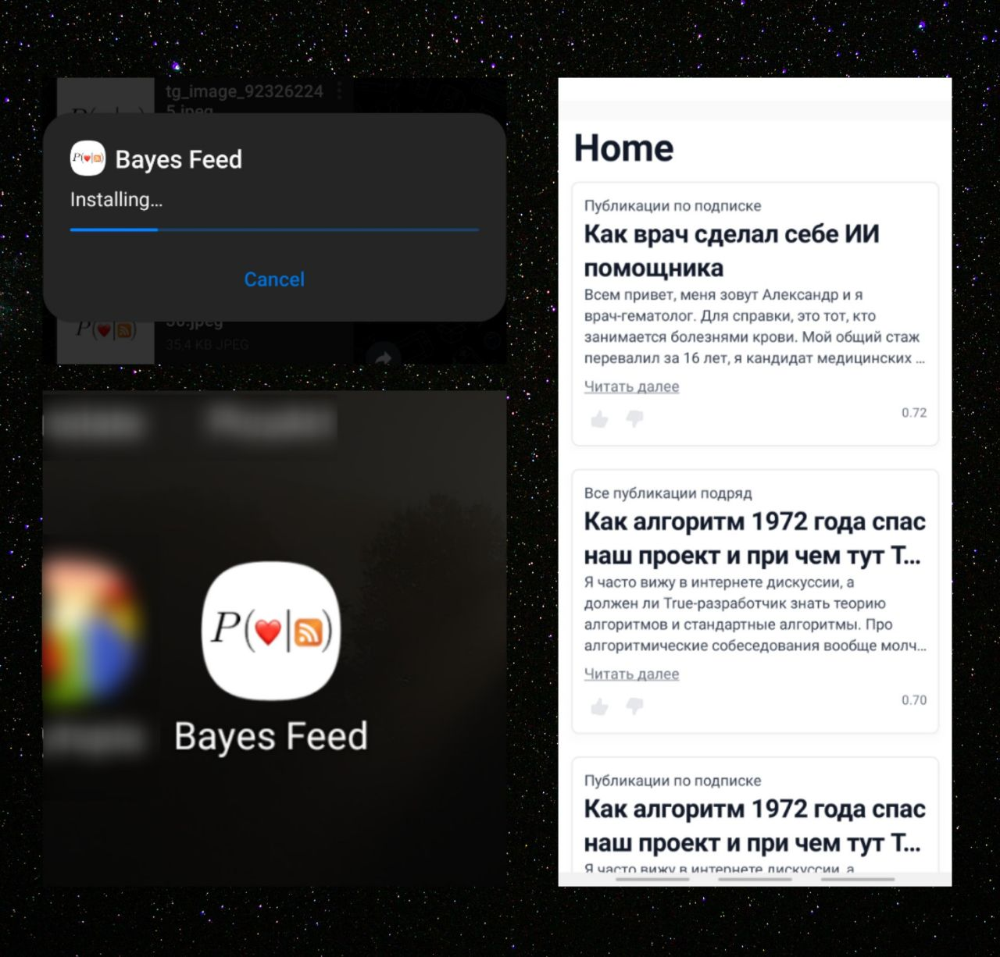

# Bayes Feed (Android)


RSS feed with a Naïve Bayes classifier that learns from your reactions. You like or dislike posts; the algorithm predicts what you'll enjoy and gets better over time.

**This repo is the Android app.** The **web app** (which I built first) is **[bayes-feed-web](https://github.com/nomomon/bayes-feed-web)**.

---

## What it does

Same idea as the web version: aggregate posts from RSS feeds, run text through a Naïve Bayes model to predict "like" vs "dislike," and let you react with thumbs up/down. Your reactions sync to Firestore so the model improves as you use it.



## Tech

- **Expo** / **React Native**
- **Firebase** (Auth, Firestore) — same backend as the web app
- **NativeWind** (Tailwind-style styling for RN)
- **react-native-rss-parser** for feeds; classifier logic ported from the web app

## How to run

```bash
npm install
npx expo start
```

Open on a device or emulator (Expo Go, or build a dev client). To build an APK:

```bash
npx expo prebuild
npx expo run:android
```

(or use EAS Build if you use Expo Application Services).

## Story

I built the **web app** first ([bayes-feed-web](https://github.com/nomomon/bayes-feed-web)): Next.js + MUI + Firebase, live on Vercel. After trying Vercel, paid Heroku, and a server on my phone, I still wanted a free, simple app I could use on the go. So I rewrote Bayes Feed as a native app.

Migration was straightforward: I copied the Naïve Bayes logic and Firebase usage from the web app. The UI had to be redone—React Native doesn't have a single component library that looks the same on iOS and Android, so I used NativeWind and adapted Tailwind-style components for native. Building the APK was a single command. Learned a lot about shipping a real mobile app.

---

*MIT*
